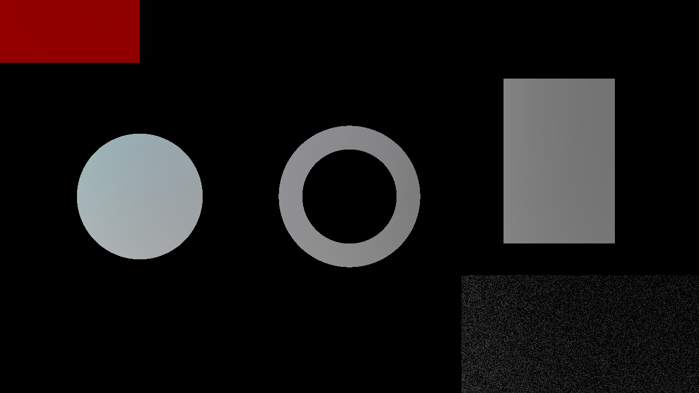

# Vocoder

> **AI-assisted project.** This codebase was created with [Claude](https://claude.com/claude-code)
> (Anthropic), directed and reviewed by a human author. The central claim is
> numerical, so it is measured rather than asserted: an offline harness drives
> the real plugin class in a headless GL context and checks that the pyramid
> reconstructs its input **exactly — a maximum difference of 0** at 720p, 1080p
> and 4K; that its bands genuinely partition the picture (9.5e-07); that the
> shipped shaders compute what an independent CPU implementation of
> Burt–Adelson computes (1.2e-07 over eight bands); that a sine in audio band
> *k* moves picture band *k* and no other; and that the envelope followers keep
> their attack and release times. A control sweep fails if any parameter turns
> out to do nothing. It **has** been registered, loaded and instantiated in
> Resolume Arena 7.27.1 — on Windows, on a software rasteriser, with the shaders
> compiling — but it has **never run on a GPU in Resolume**, and has never been
> instantiated in Arena on macOS. Check it in your own rig before trusting it in
> a show.

A channel vocoder with the picture as the carrier, as an FFGL effect for
[Resolume](https://resolume.com) Arena and Avenue.

## The one idea

A channel vocoder splits the **carrier** into frequency bands and sets each
band's gain from the matching band of the **modulator**. That is the whole
machine; everything else is a choice of what to put in it.

So put a picture in it. The carrier is the frame, its "frequency" is **spatial**
frequency, and the modulator is the audio. Split the frame into a Laplacian
pyramid — eight octave bands, from one-pixel detail up to 128-pixel shapes, plus
a residual — multiply each band by a gain, and sum them back.

With every gain at 1× the input comes back **exactly**, and not approximately:
the reconstruction is arranged so that the thing being expanded is a difference
that is identically zero, so the output is the input to the bit. That is the
plugin's null, and it is what makes everything else honest.

## What falls out of it



<sub>"Spectrum only" — the Residual at 0, so the picture's DC and coarsest shapes
are removed and what is left is the picture as its detail bands. Rendered by
`vctest`, the offline harness, not captured from Resolume. The source card is
[docs/card.png](docs/card.png).</sub>

**A graphic EQ for spatial frequency**, when nothing is routed to it. A boost at
the 4 px band makes the picture *ring* at 4 px; a cut removes detail at that
scale and leaves every other scale alone; a tilt across the bank is sharpen at
one end and soften at the other. This is not a blur and not a sharpen filter —
it is nine independent faders across scale.

**A vocoder**, when audio is routed. The eight audio bands drive the eight
picture bands: bass pumps the large shapes and treble sparkles the fine detail,
or the reverse by a switch. The audio gains *multiply* the slider gains, so a
band you have cut stays cut whatever the music does.

**A new kind of edge picture**, by turning the Residual down. What is left is
the picture as its detail bands — the image above.

## Controls

**EQ** — `Band 1 (1 px)` … `Band 8 (128 px)`, `Residual`, `Tilt`, `Master`,
`Carrier`.

The band sliders are **0 to 4×, linear, with 1× at a quarter**. That is unusual
and deliberate: a graphic EQ's fader is symmetric in dB, but a vocoder band's
gain is a multiplier that spends most of its life between "off" and "as loud as
the carrier", so this gives the cut side a usable length and the boost side room
to ring. `Tilt` is ±6 dB per band about the middle of the bank. `Carrier` picks
RGB (all three channels) or Luma (Y only, keeping the input's colour).

A band's *name* is its level's sampling pitch. Its power actually peaks a little
lower — an octave band of a Burt–Adelson pyramid is centred well below its
level's Nyquist — so the "4 px" band rings with a period of about 21 px.
`vctest --band` measures that rather than assuming it, and the numbers are in
[Status](#status).

**Audio** — `Audio` (the source picker), `Drive`, `Floor`, `Attack`, `Release`,
`Mapping`, `Sidechain Mode`.

`Drive` is how far a fully driven band swings, 0–24 dB. `Floor` is what a
**silent** band does: at 0 quiet bands go dark, at 1 the audio only ever adds.
`Mapping` is Direct (low audio → coarse picture band) or Reverse. `Sidechain
Mode` is Vocoder (one envelope per band) or Dynamics (one envelope for the lot,
driving the Tilt).

**Output** — `Mix`.

## Status

**v0.1.0, and honestly early.** Everything below is measured by
`tools/verify.sh` on an M4 Max, macOS 26.4, against a fresh universal Release
build.

| Check | Result |
| --- | --- |
| Reconstruction is exact | max difference **0** at 720p, 1080p and 4K, all gains at 1× |
| …through the Luma carrier | 5.96e-08 (a Y/Cb/Cr round trip on top) |
| The bands partition the picture | 9.54e-07 — the eight band-cuts sum to what the algebra says |
| Shipped shader vs CPU pyramid | **1.2e-07** worst, over all eight bands |
| Each band is where it should be | peaks at 2.0, 10.1, 21.5, 43.5, 87.3, 174.5, 347.0, 677.1 px — doubling, as an octave bank must |
| Audio band *k* → picture band *k* | 16 mapping cases exact; 10 of them re-checked through the picture against the equivalent slider, **max difference 0** |
| Envelope followers | attack and release within **0.0%** of the time constants, at three settings |
| No dead controls | all **19** swept parameters measurably change the picture (2 skipped, with reasons) |
| macOS binary | universal (`arm64 x86_64`), exports `plugMain`, ad-hoc signs |
| As a host reads it | `oxbow probe`: **SW Vocoder**, `VC01`, effect, 24 parameters in 4 groups, none truncated |
| Render cost | 0.77 ms at 720p, 0.66 at 1080p, 1.89 at 4K |

The render cost is not a typo: 1080p is *faster* than 720p. There are 33 passes
for eight levels and most of them are tiny, so at small sizes the per-pass
overhead dominates and the pixel count barely matters. At 4K it is 11% of a
60 fps frame.

### In Resolume, on Windows

On 2026-09-21 the plugin was put in front of a real host for the first time:
**Resolume Arena 7.27.1** (build 15990) on win-lab, an x64 Windows 11 Pro VM
with **no GPU**, so OpenGL came from **Mesa llvmpipe** — the plugin reported
`Mesa … llvmpipe (LLVM 22.1.8, 256 bits) … 4.5 (Core Profile) Mesa 26.2.0`
itself.

| Check | Result |
| --- | --- |
| Windows x64 DLL | cross-compiled in the Parallels guest on the Mac (ARM64 Windows 11, MSVC 2022 Build Tools, `cmake -A x64`, vcpkg `x64-windows-static-md`) — **372,736 bytes**, `dumpbin /EXPORTS` shows `plugMain` |
| Arena registers it | Arena's own REST API lists **SW Vocoder** among 112 video effects, under `idstring` `VC01`, with the description the plugin declares |
| Arena loads the DLL | the plugin wrote `plugin loaded build=<stamp>` to its diag log, with the stamp of the DLL built minutes earlier |
| Arena instantiates it, and the shaders compile | applied from Arena's own effects browser; logged the GL strings then `initialised`, and Arena drew its inspector, groups and all |
| Host clock unit, in a real host | logged `host clock unit decided: milliseconds` inside Arena, against seconds under oxbow — the first time that code has met a real host |
| Headless on x64 Windows | `oxbow selftest`: **120 frames, gl error 0x0, PASS**, 921,600/921,600 lit pixels (100%) |
| Warnings or errors | none — the diag log is clean of WARN/ERROR/FAIL |

**No GPU was involved**, so nothing here says anything about performance on
Windows and nothing was timed there; the ms/frame figures above remain
macOS-only.

**Not verified.** It has never been instantiated in Arena on macOS, and it has
never run on a GPU in Resolume on either platform. **No real audio reached it in
Arena**: the audio paths are still exercised only by the harness's synthetic
spectrum, because the host is the only thing that can fill an FFT buffer. So
what Resolume's 64 FFT bins actually *mean* is **still assumed rather than
measured**, and remains the biggest open question in the repo — see
[AGENTS.md](AGENTS.md), which is where the assumption is written down. No long
session, no composition save/reload and no preset recall in the host were
exercised either. There is no OpenFX port, no browser demo, no factory presets
and no release tag.

## Build

Needs CMake 3.15+, a C++17 compiler, and the FFGL SDK submodule.

```bash
git clone --recursive https://github.com/stoatworks-labs/vocoder
cd vocoder
cmake -B build -DCMAKE_BUILD_TYPE=Release
cmake --build build
cmake --install build    # → ~/Documents/Resolume Arena/Extra Effects
```

macOS builds universal (arm64 + x86_64) by default. Add
`-DCMAKE_OSX_ARCHITECTURES=arm64` for a faster development build.

## Building and testing

The offline harness renders the real plugin class headlessly:

```bash
./build/vctest --out /tmp/frame.png     # the test card, through the plugin
./build/vctest --list                   # every parameter and its default
./build/vctest --identity               # the reconstruction is exact
./build/vctest --band                   # each band, against the CPU pyramid
./build/vctest --audio                  # a sine in band k drives band k
./build/vctest --envelope               # the followers' time constants
./build/vctest --bench                  # 720p through 4K
python3 tools/sweep.py                  # no control is silently dead
tools/verify.sh                         # all of it, on a fresh universal build
```

`--feed L` writes a synthetic spectrum, without which the Audio group is
correctly dead offline.

<!-- attributions:start -->
This project is built on other people's work — see [ATTRIBUTIONS.md](ATTRIBUTIONS.md).
<!-- attributions:end -->

## Licence

MIT — see [LICENSE](LICENSE).

The Laplacian pyramid is Burt and Adelson's, from *The Laplacian Pyramid as a
Compact Image Code* (1983); the channel vocoder it stands in for is Homer
Dudley's (1939). Both are described in the published literature, not copied from
anyone's source — the implementation here is this repo's own.
